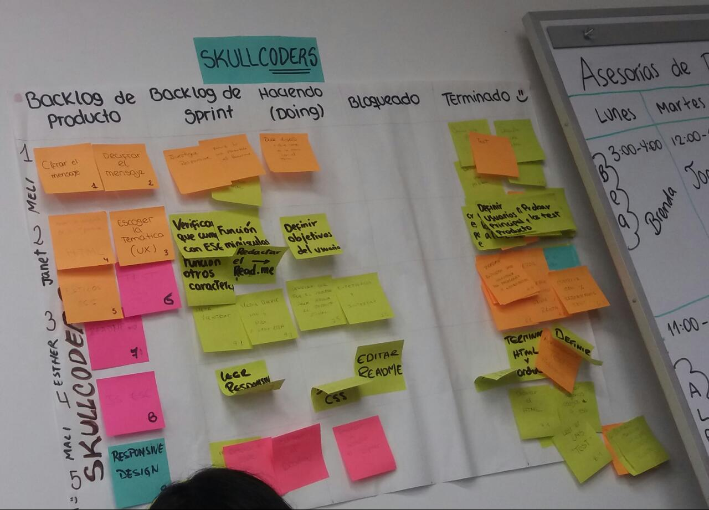
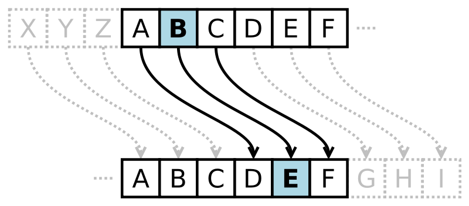
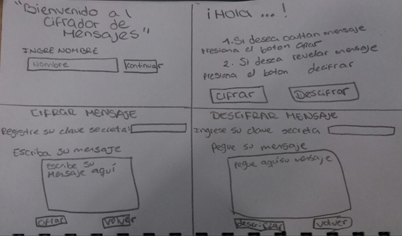
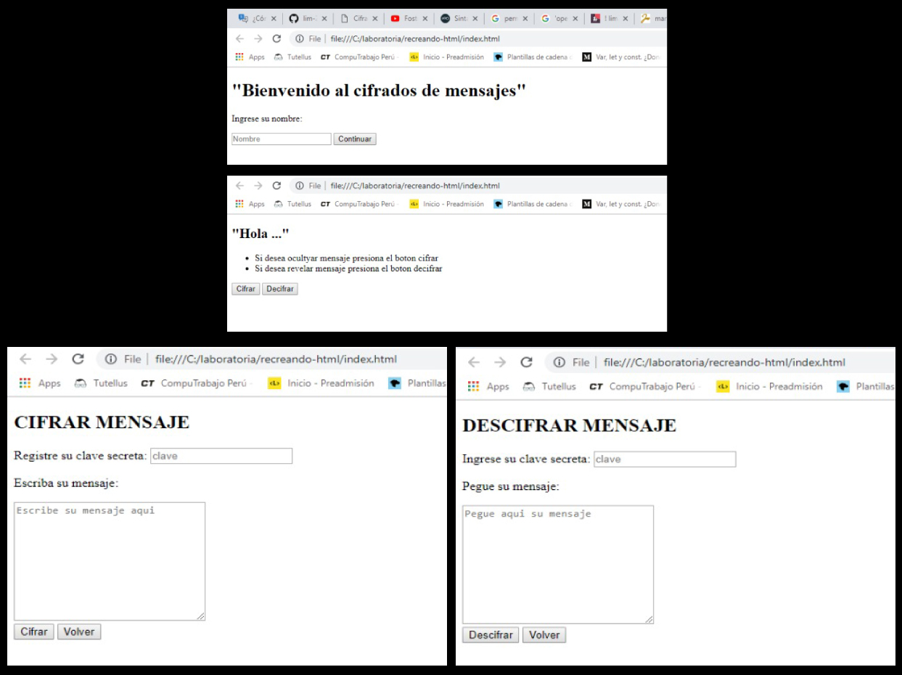

# Cifrado César
Para iniciar con el proyecto utilizamos una metodología ágil llamada "Scrum", aquí planificamos
y desarrollamos nueve tareas generales a realizar. Todos estos conceptos e ideas claras lo plasmamos
en el papelografo, en el cual se dividian en cinco columnas.

## Primer Sprint 
Para este primer sprint empecé a "descuartizar al muerto", incie con la función del cifrado.Para esto 
comence a investigar y leer acerca de como cifrar y descifrar una letra atraves del modelo cifrado Cesar.

Termine por completar la tarea del cifrado, lo testeaba a traves de consola. Para este segundo paso, opte
por realizar la estructura html básica para el proyecto.

## Segundo Sprint
Para este segundo sprint lo primero que se hizo fue realizar la prueba de testing, el cual me tomo un par
de dias para completar exitosamente el proceso.

Lo segundo, fue realizar las tareas de estilo para darle vida a la pagina web, me tomo dias para culminar esta 
tarea ya que se complico en pensar como debia ser y que colores deberia tener, fue muy arduo el proceso de 
seleccionar y crear la interfaz para el usuario. 

En esta primera parte se mostrara la primera fase que tuvo el proyecto:

## Primer prototipo

Como vemos en las imagenes, cada boton hacia la función de llevarte la siguiente sección, en esta parte aun no 
tenia los estilos ya que decidi cambiar la estructura del proyecto.

En esta segunda parte se mostrara la segunda fase que tiene el proyecto:
## Segundo Prototipo

como vemos en las imagenes, en esta segunda fase se concluyo que los botones como anteriormente lo vimos,
te llevaba a la siguente sección, entonces aquí opte por hacerlo mas fácil de manejar ese proceso de volver
y copiar el texto para el descifrado. Cree una seccion de la pagina para que siempre permanezca y al momento
de querer ir a una de estas tres opciones se le facilite.
